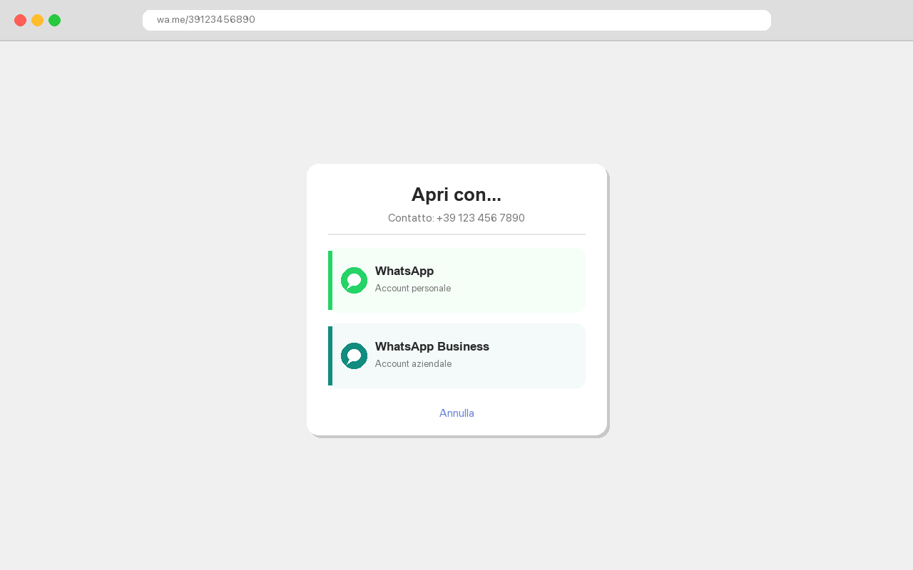

# WhatsApp Chooser

Chrome extension that lets you choose between **WhatsApp** and **WhatsApp Business** when opening `wa.me` links on macOS.



## How it works

When you click a WhatsApp link (`wa.me/...`, `api.whatsapp.com/send?...`), the extension intercepts it and shows a chooser popup. You pick which app to open, and it launches the correct one.

## Installation

### Quick install (recommended, macOS)

For everyday users who installed the extension from the Chrome Web Store.

1. Install the **WhatsApp Chooser** extension from the Chrome Web Store.
2. Install the native helper with [Homebrew](https://brew.sh):

   ```bash
   brew tap onemanjoe/whatsapp-chooser https://github.com/onemanjoe/whatsapp-chooser
   brew install whatsapp-chooser-host
   whatsapp-chooser-host configure   # set your WhatsApp app names
   whatsapp-chooser-host register    # register with Chrome
   ```
3. Quit Chrome completely (`Cmd+Q`) and reopen it.

The formula compiles the helper from source on your machine, so there is no
code-signing or Gatekeeper prompt. Manage it later with
`whatsapp-chooser-host status`, `unregister`, or `configure`. See
[native-host/HOMEBREW.md](native-host/HOMEBREW.md) for details.

### Manual install (development, or without Homebrew)

#### 1. Load the Chrome extension

1. Open `chrome://extensions`
2. Enable **Developer mode** (top right)
3. Click **Load unpacked** and select the `whatsapp-chooser` folder
4. Copy the **Extension ID** shown under the extension name

#### 2. Install the native messaging host

```bash
cd whatsapp-chooser/native-host
./install.sh
```

The installer will:
- Ask you the name of your WhatsApp apps (as they appear in `/Applications`)
- Compile the native messaging host
- Register it with Chrome

The script uses the official extension ID by default. If you're developing locally with a different ID, pass it as an argument: `./install.sh YOUR_EXTENSION_ID`

> **Note:** You need Xcode Command Line Tools installed. If you don't have them, run `xcode-select --install`.

#### 3. Restart Chrome

Quit Chrome completely (`Cmd+Q`) and reopen it.

## Configuration

App names are read from `~/.config/whatsapp-chooser/config.json` first, falling
back to `native-host/config.json` next to the binary for manual installs:

```json
{
  "whatsapp_app": "WhatsApp",
  "business_app": "WhatsApp Business"
}
```

Edit this if you rename your apps or use third-party WhatsApp clients. With the
Homebrew install, run `whatsapp-chooser-host configure` instead of editing by hand.

## Requirements

- macOS
- Google Chrome
- Xcode Command Line Tools (for compiling the native host)
- Both WhatsApp and WhatsApp Business (or compatible clients) installed

## How it works (technical)

1. **Chrome extension** (`background.js`) intercepts navigation to `wa.me` / `api.whatsapp.com` domains
2. Redirects to the **chooser page** (`chooser.html`) which shows two buttons
3. On click, the chooser calls Chrome's **native messaging** API
4. A compiled **C binary** (`native-host/host`) receives the message and runs `open -a "AppName" "whatsapp://send?..."` to launch the selected app
5. App names are read from `~/.config/whatsapp-chooser/config.json` (or `config.json` next to the binary for manual installs) so each user can configure their own app names

## License

MIT
